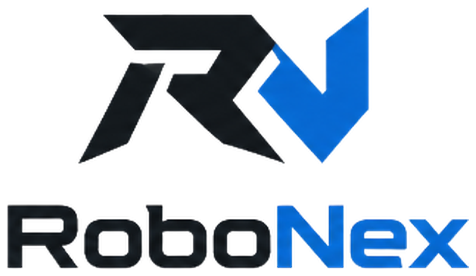

<picture>
  <source media="(prefers-color-scheme: dark)" srcset="images/robonex_logo_dark.png">
  
</picture>

 

<table>
    <tbody>
    <tr><th> Title </th> <th>Description</th> <th>GitHub</th></tr>
    <tr>
        <td colspan="1" rowspan="2" align="center"> Locomotion </td>
        <td><a href="https://github.com/Humanoid-Project/robonex-walking" target="_blank">robonex-walking</a>   Walking RL in Isaac Lab </td>
        <td align="center"></td>
    </tr>
    <tr>
        <td><a href="https://github.com/Humanoid-Project/robonex-balancing" target="_blank">robonex-balancing</a>   Standing-balance RL in Isaac Lab </td>
        <td align="center"></td>
    </tr>
    <tr>
        <td colspan="1" rowspan="1" align="center"> Robot Model </td>
        <td><a href="https://github.com/Humanoid-Project/robonex-description" target="_blank">robonex-description</a>   URDF, MuJoCo and Isaac robot models </td>
        <td align="center"></td>
    </tr>
    <tr>
        <td colspan="1" rowspan="2" align="center"> Deployment </td>
        <td><a href="https://github.com/Humanoid-Project/robonex-deploy" target="_blank">robonex-deploy</a>   Policy deployment to MuJoCo and the real robot </td>
        <td align="center"></td>
    </tr>
    <tr>
        <td><a href="https://github.com/Humanoid-Project/robonex-common" target="_blank">robonex-common</a>   Shared joint, motor and CAN contracts </td>
        <td align="center"></td>
    </tr>
    <tr>
        <td colspan="1" rowspan="3" align="center"> Hardware Tools </td>
        <td><a href="https://github.com/Humanoid-Project/robstride-motor-test" target="_blank">robstride-motor-test</a>   RobStride motor CAN tools </td>
        <td align="center"></td>
    </tr>
    <tr>
        <td><a href="https://github.com/Humanoid-Project/imu-n100-test" target="_blank">imu-n100-test</a>   WHEELTEC N100 IMU SDK </td>
        <td align="center"></td>
    </tr>
    <tr>
        <td><a href="https://github.com/Humanoid-Project/realsense_d435i_test" target="_blank">realsense_d435i_test</a>   RealSense D435i camera tests </td>
        <td align="center"></td>
    </tr>
    <tr>
        <td colspan="1" rowspan="1" align="center"> Reference </td>
        <td><a href="https://github.com/Humanoid-Project/atom01-rl-locomotion" target="_blank">atom01-rl-locomotion</a>   Locomotion RL study on Atom01 </td>
        <td align="center"></td>
    </tr>
    </tbody>
</table>
